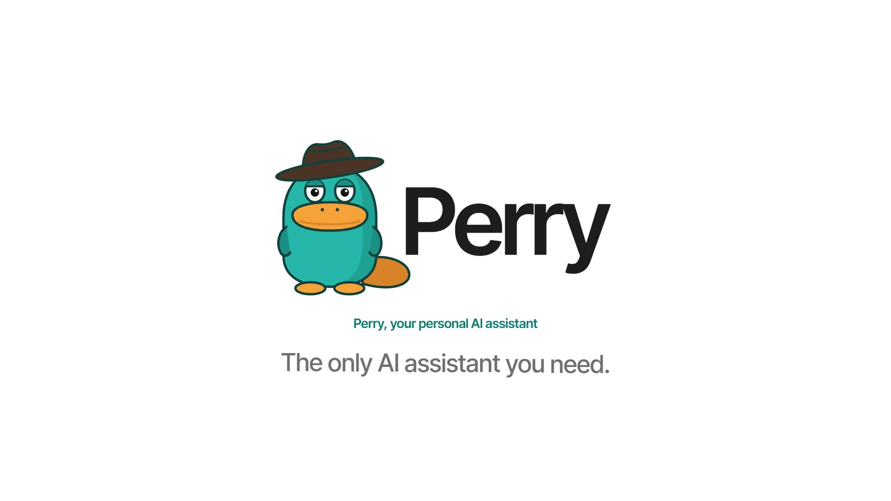

<p align="center">
  
</p>

<p align="center">
  <b>A personal AI assistant that runs on your own computer.</b><br>
  Talk to it on Telegram, WhatsApp or the web. It remembers you, works on your
  machine, and reaches your accounts, with your ChatGPT subscription as its brain.
</p>

<p align="center">
  <a href="https://perry-gamma.vercel.app">Website</a> ·
  <a href="INSTALL.md">Install guide</a> ·
  <a href="https://github.com/TheM1N9/perry/issues">Issues</a> ·
  <a href="LICENSE">MIT License</a>
</p>

---

## What it is

Perry is an assistant you install once and then just message. It thinks with
the [Codex CLI](https://github.com/openai/codex) on your ChatGPT subscription,
so there is no API bill and no extra account to make.

Everything stays yours: Perry runs on your computer, keeps its data in a
single file there, and has no server of its own to send anything to. Anyone
can run their own copy, and every copy is separate.

## What you can do with it

- **"Remind me to call Sam at 2."** Keeps a to-do list and nudges you until
  things are done, on your phone or on your screen.
- **"Every weekday at 8, brief me on my calendar."** Runs scheduled jobs and
  one-off reminders in your timezone, and stays quiet when there is nothing new.
- **"Tell me when this page changes."** Watches web pages and lets you know.
- **"Clean up my Downloads folder."** Works on your computer, with a shell and
  your files, asking before anything outside its sandbox.
- **"What's on my calendar? Draft a reply to that email."** Connects to Gmail,
  Google Calendar, Notion and more through [Composio](https://composio.dev).
- **"From now on, keep replies short."** Remembers who you are, what you like
  and what you told it last week.
- **Hold a hotkey and talk.** An optional desktop companion sits in a corner
  of your screen with your chats, to-dos and approvals, and takes voice input
  transcribed on your machine.
- **"What's this error?"** Another hotkey shows the companion the window
  you're in, so you can ask about it. You see the picture before it's sent.
  Perry can also look for himself when a question is about your screen, and
  the chat shows what he saw. You can turn that off in Settings → Desktop pet.

## Install

You need a ChatGPT account (for Codex) and a Mac, Linux or Windows computer.

macOS or Linux:

```bash
curl -fsSL https://raw.githubusercontent.com/TheM1N9/perry/main/install.sh | sh
```

Windows (PowerShell):

```powershell
iwr -useb https://raw.githubusercontent.com/TheM1N9/perry/main/install.ps1 | iex
```

The installer adds anything missing (Node.js, pnpm, Bun, the Codex CLI), puts
Perry in `~/perry`, and walks you through setup: sign in to Codex, optionally
connect a Telegram bot, and open the dashboard. Perry then runs in the
background and starts with your computer.

Already cloned the repo? Run `pnpm install` and then `pnpm perry setup`.
[INSTALL.md](INSTALL.md) has the details for each OS.

## Using it

```bash
perry open      # open the dashboard
perry status    # is it running, and where
perry logs -f   # follow what it is doing
perry update    # get the latest version
perry pet       # put Perry on your desktop (perry pet off to remove)
perry doctor    # check that everything is set up right
perry stop | start | uninstall
```

Perry keeps himself up to date: when there is a new version, the dashboard and
the pet say so, one click from updating, and at night (around 4:00 your time)
he updates himself if he isn't busy. Settings → General turns that off.

Chat from the dashboard, Telegram or WhatsApp. WhatsApp is linked from the
dashboard's settings; it uses an unofficial connection, so a separate number
is recommended.

Perry answers while your computer is on. On Windows it wakes a sleeping
computer for scheduled jobs and reminders (Work → Schedules). macOS and Linux
only let an administrator set wake times, so there they wait for the computer
to wake. For an assistant that is always there, run it on a machine that
stays on, like a Mac mini or a home server.

## You stay in control

- **Approvals.** Anything beyond its sandbox is asked first, in the dashboard
  and on Telegram. "Always allow" saves a rule you can review and delete.
- **Supervised or full access**, chosen per chat.
- **Everything is logged.** Every reply has a trace of the commands, file
  changes and tool calls behind it.
- **Your data is local.** Chats, memory and files live in `~/.perry`.
  Connected-account tokens are held by Composio, never by Perry.

## Contributing

Issues and pull requests are welcome. See [CONTRIBUTING.md](CONTRIBUTING.md)
for how to run Perry from source.

## Acknowledgements

Inspired by [OpenClaw](https://github.com/openclaw/openclaw). Parts of Perry
are adapted from Vercel's [eve](https://github.com/vercel/eve) (Apache 2.0; see
[NOTICE](NOTICE)). Voice input follows
[OpenWhispr](https://github.com/OpenWhispr/openwhispr), and the desktop
companion [Petodo](https://www.petodoapp.com/petodo/).

## License

[MIT](LICENSE)
